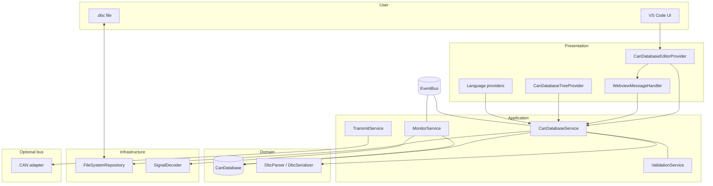
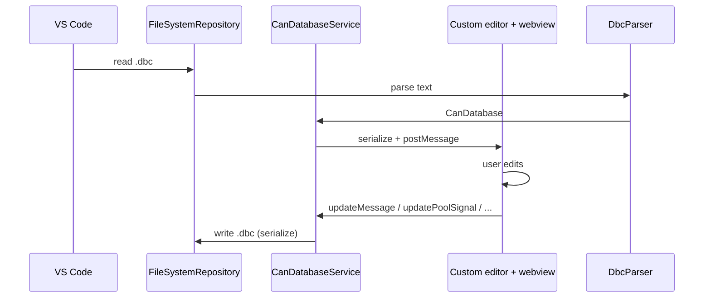
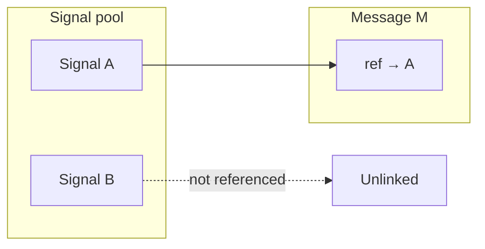

# vscode-canbus architecture

High-level view of how the extension is structured: **persistence**, **domain**, **application services**, **presentation** (custom editor, webview, tree, language features), and **optional hardware** (monitor / transmit).

## Layered overview

- **CanDatabase** is the in-memory aggregate: nodes, messages, global **signal pool**, value tables, attributes, etc.
- **CanDatabaseService** loads/saves `.dbc`, applies edits from the webview, and emits **database:loaded** / **database:changed** on the **EventBus**.
- **Custom editor** hosts a **Svelte webview** for structured editing; the same database is shown in the **sidebar tree** and used by **hover / completion / diagnostics** where applicable.
- **MonitorService** / **TransmitService** are wired only after a **bus adapter** connects; they use **SignalDecoder** and the current database for decode (and future encode paths).

## Data flow: open and edit a database

## Signal pool vs message frames

DBC signals are stored in a **global pool** (unique names). Each **message** references pool signals by name with per-frame placement (start bit, endianness, etc.). Signals that exist only in the pool and are **not linked to any message** are **unlinked** (sometimes called dangling): they round-trip in a DBC extension block until assigned or removed.

The **CAN Database** sidebar tree lists **Unlinked signals** separately, with a warning affordance so they are easy to spot.

## Where to look in the repo

| Area | Typical location |
|------|------------------|
| Domain models | `src/core/models/database/` |
| DBC parse/serialize | `src/infrastructure/parsers/dbc/` |
| Load/save, edits | `src/application/services/CanDatabaseService.ts` |
| Webview protocol + serialization | `src/presentation/webview/` |
| Custom editor | `src/presentation/editors/CanDatabaseEditorProvider.ts` |
| Sidebar tree | `src/presentation/views/treeview/` |
| Webview UI | `webview-ui/src/` |

In the **DBC custom editor**, the **Architecture** tab (`ArchitectureView.svelte`) shows the same layered extension overview plus a **live network map**: every **BU_** node from the loaded file, with messages grouped by **transmitter**, plus frames whose transmitter is missing or not in the node list.

Diagrams in this file use [Mermaid](https://mermaid.js.org/); they render on GitHub and in many Markdown preview tools.
