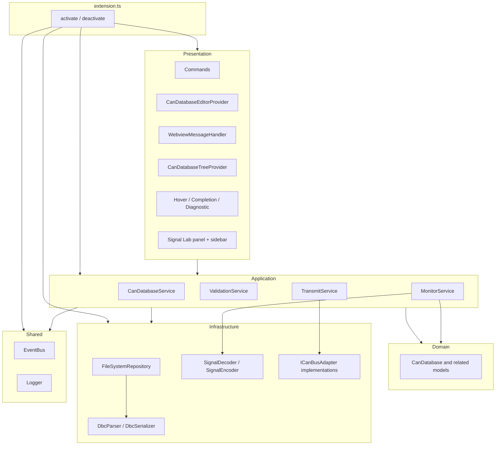

# Overview: components and layers

The extension host code under `src/` is organized in **layers**. Dependencies point **inward**: presentation and application may use domain and infrastructure; **domain** must not import VS Code APIs.

## Layer map

## How data crosses boundaries

1. **User opens a `.dbc`** → VS Code loads the document → **CanDatabaseEditorProvider** calls **CanDatabaseService.loadFromTextDocument** (or **OpenDatabaseCommand** uses **load** from disk).
2. **Repository** reads bytes / text → **DbcParser** builds **CanDatabase** → service stores it in a **session map** keyed by document URI and emits **database:loaded** on **EventBus**.
3. **Webview** receives **database.update** JSON from **serializeDatabaseForWebview**; edits post messages back → **WebviewMessageHandler** calls service mutators → **persistEditorDocument** rewrites the text buffer.

## Optional CAN bus path

**ConnectBusCommand** creates an **ICanBusAdapter**. On success, **extension.ts** constructs **MonitorService** and **TransmitService**, injects them into **WebviewMessageHandler** and **CommandRegistrar**, and subscribes monitor decode to the **active bus database** URI from **CanDatabaseService**.

## Next

- [02-extension-entry.md](02-extension-entry.md) — exact wiring in `extension.ts`
- [03-application-layer.md](03-application-layer.md) — what `CanDatabaseService` owns
