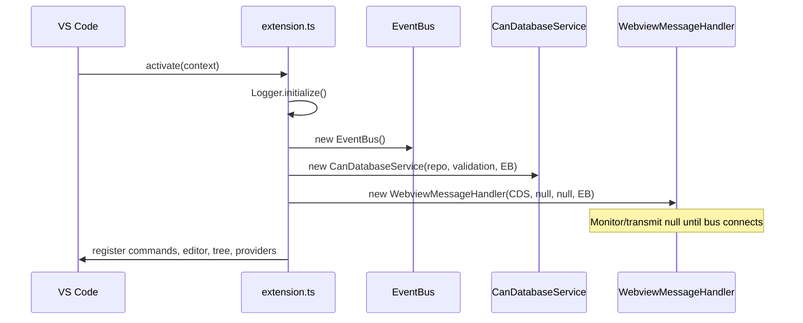

# Extension entry (`src/extension.ts`)

`extension.ts` is the **composition root**: it constructs services once, registers VS Code contributions, and connects **bus lifecycle** callbacks.

## Activation sequence

### Step-by-step

1. **Logger** — single output channel for diagnostics.
2. **EventBus** — typed pub/sub for `database:*` and `bus:*` events (see `shared/events/EventTypes.ts`).
3. **FileSystemRepository** + **ValidationService** + **CanDatabaseService** — database lifecycle.
4. **CommandRegistrar** — registers open DB, connect/disconnect bus, monitor/transmit commands; holds a reference to **ConnectBusCommand** for adapter access.
5. **WebviewMessageHandler** — starts without monitor/transmit; **setMonitorService** / **setTransmitService** run after connect.
6. **Signal Lab** — status bar + sidebar webview provider read snapshots from the message handler.
7. **ConnectBusCommand callbacks** — on adapter connected: create **MonitorService** (with **SignalDecoder**), **TransmitService**, wire **database:loaded** / **database:changed** / **bus:activeDatabaseUriChanged** so the monitor always uses the DB that matches the active URI for the bus.
8. **onAdapterDisconnected** — clears monitor/transmit on handler and registrar.
9. **CanDatabaseEditorProvider.register** — custom editor for `*.dbc`.
10. **CanDatabaseTreeProvider** — explorer tree; refreshes on database events.
11. **Language providers** — completion, hover, diagnostics; diagnostics use **ValidationService** via **CanDatabaseService**.

## Deferred reference: SignalEncoder

`SignalEncoder` is constructed next to **SignalDecoder** for symmetry; transmit currently builds raw frames in the webview path. The instance is kept so future encode paths can inject without reshaping `activate`.

## Subscriptions

Everything that must outlive a single command is pushed to **`context.subscriptions`** (or returns a **Disposable** from `register*`). Bus teardown uses a nested **dispose** that stops monitor and transmit when the adapter disconnects or the extension deactivates.

## Next

- [03-application-layer.md](03-application-layer.md) — service responsibilities
