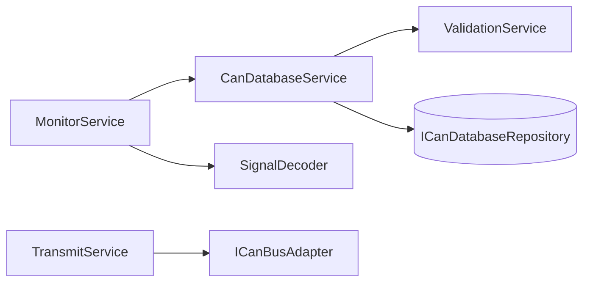

# Application layer

Located under `src/application/services/`. These classes **orchestrate** domain objects, persistence, and validation; they emit domain events through **EventBus**.

## Service relationships

## CanDatabaseService

**Responsibility:** One **CanDatabase** instance per open document URI (session map). Handles:

- **load** / **loadFromTextDocument** — parse via repository, set **activeBusDatabaseUri** for bus decode, emit **database:loaded**.
- **serializeDocument** — DBC text for **DocumentTextSync** after edits.
- **save** / **saveAs** — write through repository.
- **Mutators** — `updateMessage`, `updateSignal`, pool signal CRUD, nodes, attributes, value tables, etc.; each updates the in-memory model and emits **database:changed** where applicable.

**Active URI for bus:** `getActiveBusDatabaseUri` / `setActiveBusDatabaseUri` — which session **MonitorService** uses for decode when hardware is connected.

## ValidationService

Implements **IValidationService**. Runs structural checks on **CanDatabase**; results feed **DiagnosticProvider** (squiggles) and can be shown in the webview.

## MonitorService

Created **only after** a bus adapter connects. Subscribes to the adapter’s frame stream, uses **SignalDecoder** + current **CanDatabase** to produce **DecodedMessage** / frame events, emits on **EventBus** for Signal Lab and status UI.

## TransmitService

Sends **CanFrame** instances and manages periodic tasks. No VS Code dependency; adapter errors surface through logging and task stop logic.

## Next

- [04-domain-infrastructure.md](04-domain-infrastructure.md) — models and DBC I/O
