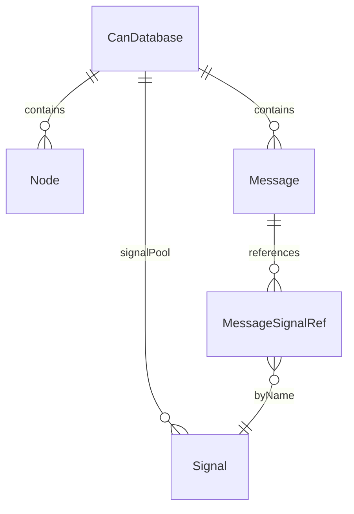
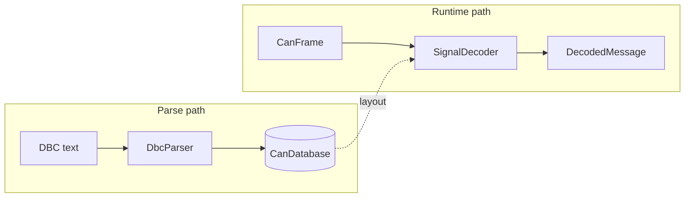

# Domain and infrastructure

## Domain (`src/core/`)

Pure TypeScript: **no** `vscode` imports. Models describe DBC concepts: **CanDatabase**, **Message**, **Signal** (pool), **Node**, **ValueTable**, attributes, etc.

**Signal pool:** Signals live in **CanDatabase.signalPool**; messages reference them by name with bit layout (**MessageSignalRef**). Unlinked pool signals are a normal DBC authoring state (see main ARCHITECTURE doc).

## Infrastructure

| Piece | Role |
|-------|------|
| **FileSystemRepository** | Read/write `.dbc` files; delegates parse/serialize to **ParserFactory** / serializer |
| **DbcParser** / **DbcTokenizer** | Text → **CanDatabase** |
| **DbcSerializer** | **CanDatabase** → DBC text |
| **SignalDecoder** / **SignalEncoder** | Binary frame ↔ physical values using DBC layout |
| **AdapterFactory** / **SocketCanAdapter** / **VirtualCanAdapter** | Hardware or virtual bus |

## Next

- [05-presentation-layer.md](05-presentation-layer.md) — UI and webview bridge
