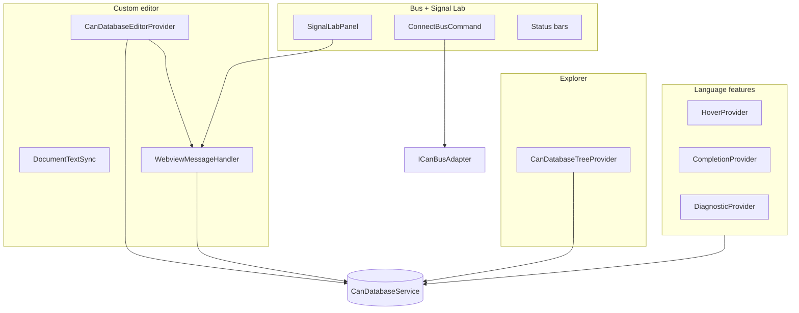

# Presentation layer

Under `src/presentation/`. This is the only layer that should call **vscode** APIs directly (windows, commands, webviews, tree).

## Major pieces

## Custom editor flow

1. **CanDatabaseEditorProvider.resolveCustomTextEditor** — builds webview HTML from `webview-ui/dist`, registers **onDidReceiveMessage** → **WebviewMessageHandler.handleMessage**.
2. **loadDatabaseForEditor** — **CanDatabaseService.loadFromTextDocument** on open and on buffer change (unless a programmatic sync is in progress).
3. User edits in Svelte → typed **WebviewToExtensionMessage** → handler mutates service → **persistEditorDocument** → **DocumentTextSync.replaceDocumentText** so the `.dbc` buffer matches the model.

## WebviewMessageHandler

- **editorContexts** — map document URI → panel + **DocumentTextSync** for persistence.
- **Signal Lab** — separate webview; receives bus frames and host state; can change active DB URI for decode.

Errors during mutation are logged (**Logger**); the webview can show errors in a follow-up if you add **ExtensionToWebviewMessage** types for failures.

## Commands

**CommandRegistrar** registers all extension commands and owns **ConnectBusCommand** / **DisconnectBusCommand** / open DB / monitor / transmit. **MonitorService** reference is updated when the bus connects so command handlers target live services.

## Tree view

**CanDatabaseTreeProvider** reads **CanDatabaseService.getDatabase** for the active selection / session and builds **TreeItem** hierarchies (nodes, messages, signals, unlinked pool).

## Next

Return to [README](README.md) or the [main ARCHITECTURE.md](../ARCHITECTURE.md) for signal pool and product behavior.
