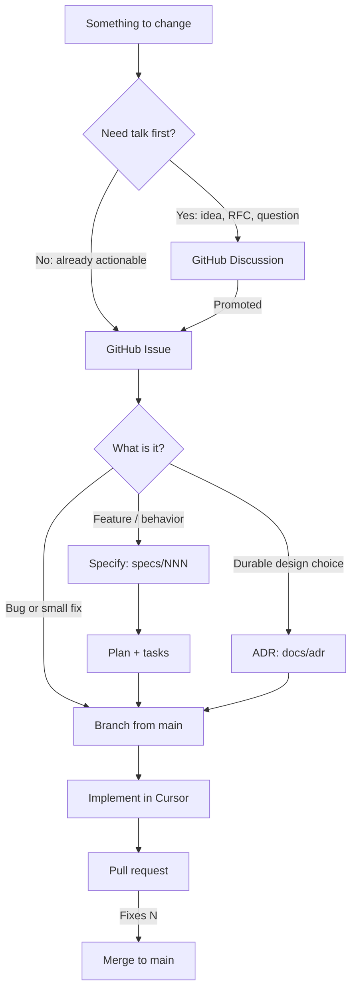

# Agentic workflow (GitHub + Cursor)

CANdb Studio keeps **intent on GitHub** and **artifacts in this repository**. Cursor (local or Cloud Agent) implements from those sources. Everything lives in **[afri-bit/candb-studio](https://github.com/afri-bit/candb-studio)** — one repo for ideas, bugs, features, ADRs, specs, and pull requests.

## One-time GitHub setup

If this is a new clone or you have not configured the remote project yet, do **[github-setup.md](github-setup.md)** first (enable Discussions, confirm Issues/PRs, apply labels). The rest of this guide assumes that is done.

## Source of truth

| Kind of work | Starts as | Detailed artifact (when needed) | Lands as |
|--------------|-----------|----------------------------------|----------|
| Idea, question, open design talk | [Discussion](https://github.com/afri-bit/candb-studio/discussions) | — | Later: issue, or close as “not now” |
| Feature | [Issue](https://github.com/afri-bit/candb-studio/issues/new?template=feature_request.yml) (`enhancement`) | `specs/NNN-name/` (Speckit) | Pull request |
| Bug / small fix | [Issue](https://github.com/afri-bit/candb-studio/issues/new?template=bug_report.yml) (`bug`) | Usually none | Pull request |
| Architecture choice | Discussion (optional) → [ADR issue](https://github.com/afri-bit/candb-studio/issues/new?template=adr.yml) | `docs/adr/NNNN-title.md` | Pull request (alone or with the feature) |
| Docs gap | [Issue](https://github.com/afri-bit/candb-studio/issues/new?template=documentation.yml) | Doc edit | Pull request |

The **GitHub issue body is the agent brief**. A human or Cursor should be able to implement (or write a spec) from the issue without a side chat. Specs and ADRs add structure; they do not replace the issue.

## Paths by size

### Bug or small fix

1. Open a **Bug** issue. Fill every required field (steps, expected, actual, versions).
2. Label `agent-ready` when the issue is complete enough to implement.
3. In Cursor: `/from-issue <number-or-url>`.
4. Open a PR that says `Fixes #<n>`.

No Speckit folder unless the fix changes product behavior enough to need a spec update.

### Feature

1. Prefer a **Discussion** (Ideas or RFC) if the problem is still fuzzy.
2. Open a **Feature** issue. Required: problem, proposed solution, **acceptance criteria**.
3. Label `needs-spec` for anything that adds user-visible capability or a new protocol/surface.
4. In Cursor: `/from-issue <n>` → that runs `/speckit.specify` from the **issue body**, then plan/tasks as needed.
5. Link the spec folder in the issue comment (`specs/014-…`).
6. Implement with `/speckit.implement` (or a focused PR if the task list is small).
7. PR: `Fixes #<n>` plus links to `specs/…` and any ADR.

### Architecture decision

1. Optional: **RFC** discussion to compare options.
2. Open an **ADR** issue (context, options, proposed decision).
3. In Cursor: `/propose-adr` (or `/from-issue` on an ADR issue).
4. Land `docs/adr/NNNN-title.md` in a PR. Status starts as **Proposed**; merge to `main` with review means **Accepted** unless the PR says otherwise.

See [ADR guide](../adr/README.md).

## What belongs where

| Put it here | Do not put it only here |
|-------------|-------------------------|
| **Issue** — problem, acceptance criteria, constraints, out of scope | Slack/Discord/chat that the agent cannot see |
| **`specs/NNN/`** — user stories, functional requirements, plan, tasks | A spec with no linked issue |
| **`docs/adr/`** — why we chose an approach that is hard to reverse | An ADR for a one-line bugfix |
| **PR** — what changed, how you tested, links to issue/spec/ADR | A PR with no issue unless it is a typo-sized chore |

## Cursor commands

| Command | When |
|---------|------|
| `/from-issue` | Start any GitHub issue (classifies bug vs feature vs ADR) |
| `/propose-adr` | Draft or update an ADR from a decision write-up |
| `/speckit.specify` | Create `specs/NNN-name/spec.md` from a feature description |
| `/speckit.clarify` | Resolve `[NEEDS CLARIFICATION]` in a spec |
| `/speckit.plan` | Technical plan, research, contracts |
| `/speckit.tasks` | `tasks.md` |
| `/speckit.analyze` | Consistency check before implement |
| `/speckit.implement` | Execute `tasks.md` |
| `/speckit.taskstoissues` | Optional: one GitHub issue per task (large features only) |
| `/speckit.checklist` | Extra quality checklist |
| `/speckit.constitution` | Amend `.specify/memory/constitution.md` |

Project agents (`frontend-webview`, `vscode-extension`, `software-architect`, `tester`, `automotive-can`, `security`, `refactoring`) are used **inside** implementation, not as a replacement for the issue.

## Labels (intent)

Applied by templates or triage. Full list: [`.github/labels.yml`](../../.github/labels.yml).

| Label | Meaning |
|-------|---------|
| `bug` / `enhancement` / `documentation` / `adr` | Type |
| `needs-triage` | Not yet classified or incomplete |
| `needs-spec` | Feature must get a Speckit folder before (or as) implementation |
| `agent-ready` | Issue body is a complete brief — safe to hand to Cursor |
| `area:*` | Editor, Signal Lab, explorer, language, parser, bus, docs, workflow |

## Pull requests

Use [`.github/PULL_REQUEST_TEMPLATE.md`](../../.github/PULL_REQUEST_TEMPLATE.md).

- One concern per PR when practical.
- `Fixes #<issue>` so GitHub closes the issue on merge.
- Link `specs/NNN-…` and `docs/adr/NNNN-…` when they exist.
- CI: lint, compile, unit tests, integration tests ([`.github/workflows/build_and_test.yml`](../../.github/workflows/build_and_test.yml)).

## Agent rules (non-negotiable)

1. **Read the issue first.** Do not invent a different problem.
2. **Stay in scope.** Out-of-scope ideas become a new issue or discussion, not drive-by code.
3. **Specs describe what and why; code and ADRs describe how.**
4. **Constitution wins** (`.specify/memory/constitution.md`): no `vscode` in domain, tests for behavior changes, small diffs.
5. **Comment on the issue** when you create a spec, ADR, or PR (path + one-paragraph summary).
6. **Do not open GitHub issues or PRs in the wrong repo.** Remote must be `afri-bit/candb-studio`.
