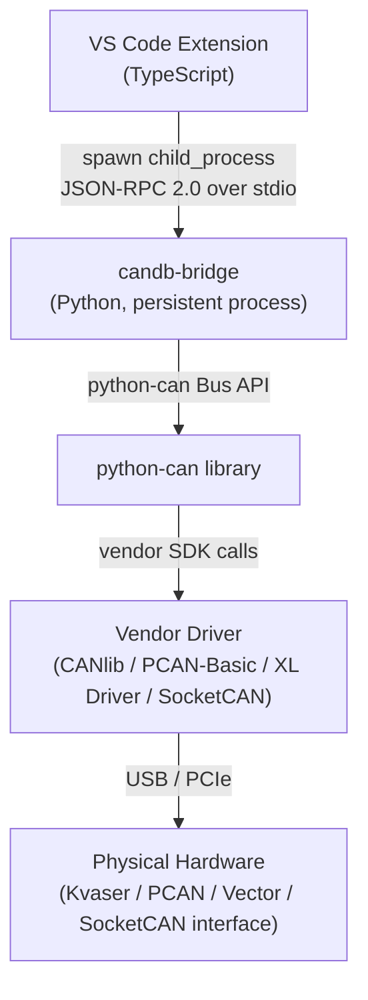
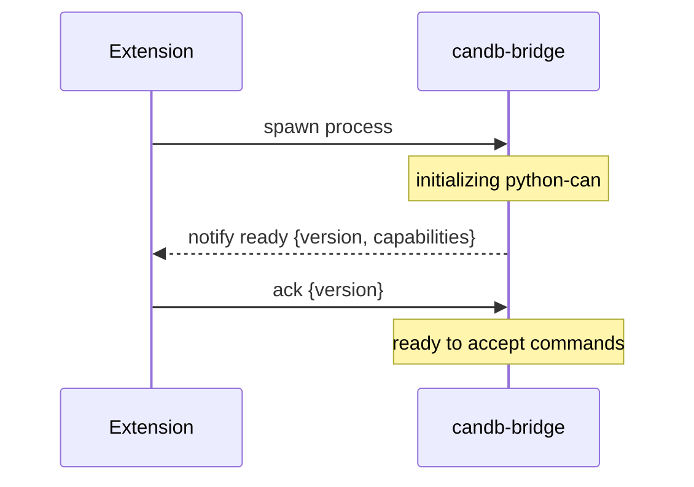

# Architecture: Multi-Vendor CAN Adapter Support

**Feature**: [spec.md](./spec.md)
**Created**: 2026-04-11
**Status**: Draft

## Overview

Multi-vendor adapter support is implemented via a **candb-bridge** — a separate Python process that acts as a local JSON-RPC server over stdio. The VS Code extension is the sole client. This avoids native addon complexity inside the extension while leveraging [python-can](https://python-can.readthedocs.io/)'s built-in support for Kvaser, PCAN, Vector, SocketCAN, and other backends.

## Architecture



### Why a bridge process instead of native addons

Each vendor exposes a C/C++ SDK. Calling these from Node.js requires N-API native addons compiled against VS Code's specific Electron ABI — a different ABI from the system Node.js. Supporting multiple vendors would mean maintaining one addon per vendor, each needing prebuilt binaries per platform (win-x64, linux-x64, darwin-arm64) per Electron version.

python-can abstracts all vendors behind a single `can.Bus(interface=..., channel=..., bitrate=...)` call. The bridge process contains all vendor-specific complexity in one place, written in a language where the SDK bindings already exist.

### Why stdio instead of TCP/WebSocket

- No port allocation or firewall issues
- The extension owns the process lifecycle (spawns it, kills it on deactivate)
- Only one client ever connects — a network transport adds no benefit
- JSON-RPC 2.0 works identically over any byte stream

## Component Responsibilities

### Extension side: `BridgeCanAdapter`

- Implements `ICanBusAdapter` (same interface as `VirtualCanAdapter`)
- Spawns the bridge process on first use
- Performs the handshake on startup
- Serializes outgoing commands to JSON-RPC requests
- Parses incoming JSON-RPC responses and frame event notifications
- Manages bridge session state
- Kills the bridge process on extension deactivate

### Bridge side: `candb-bridge`

- Starts up and immediately sends a `ready` notification with its version and capabilities
- Waits for an `ack` from the extension before accepting commands
- Accepts commands: `enumerate`, `connect`, `send`, `disconnect`
- Streams received CAN frames as `frame` event notifications
- Reports state changes (connecting, connected, disconnected, error) as `state` notifications
- Remains alive between connect/disconnect cycles — only one process instance runs per VS Code session

## Handshake Protocol

On process startup, the bridge sends a `ready` notification before accepting any commands. The extension replies with `ack`. This locks in the session and confirms both sides agree on the protocol version.



`capabilities` lists only the backends whose vendor drivers are actually installed on the host machine. The extension uses this list to determine which adapter types to show in the UI — missing drivers are hidden rather than shown as a failed option.

If the versions are incompatible, the extension surfaces an "update candb-bridge" message and does not proceed.

## Session State

After a successful handshake, the extension holds a `BridgeSession` object. Its presence is the proof that the bridge is ready. All commands check for a live session before sending.

```typescript
interface BridgeSession {
    capabilities: string[];   // e.g. ["kvaser", "pcan", "socketcan"]
    version: string;          // bridge version string
    status: "ready" | "dead";
}
```

- `status = "dead"` is set if the bridge process exits unexpectedly
- On `status = "dead"`, the extension surfaces a "bridge disconnected" error to the user
- The session is reset to `null` — no commands are accepted until a new handshake completes
- User's last selected adapter + channel are persisted separately in VS Code workspace state so the UI can pre-fill on reconnect

## JSON-RPC Command Reference

All messages follow [JSON-RPC 2.0](https://www.jsonrpc.org/specification).

### Extension → Bridge (requests)

| Method | Params | Description |
|---|---|---|
| `enumerate` | — | List available hardware channels per interface family |
| `connect` | `interface`, `channel`, `bitrate`, `fd_bitrate?` | Open a CAN bus connection |
| `send` | `id`, `data`, `extended?`, `fd?`, `brs?` | Transmit a single CAN frame |
| `disconnect` | — | Close the active connection, release hardware |

### Bridge → Extension (responses and notifications)

| Method / Result | Direction | Description |
|---|---|---|
| Response to `enumerate` | reply | `{"devices": [{"interface": "kvaser", "channels": ["0","1"]}]}` |
| Response to `connect` | reply | `{"ok": true}` or error object |
| Response to `send` | reply | `{"ok": true}` or error object |
| Response to `disconnect` | reply | `{"ok": true}` |
| `frame` notification | push | `{"id": 256, "data": [1,2,3,4], "timestamp": 1234567890.123, "fd": false}` |
| `state` notification | push | `{"status": "connected"}` — values: `connecting`, `connected`, `disconnected`, `error` |
| `ready` notification | push (on start) | `{"version": "1.0.0", "capabilities": ["kvaser", "pcan"]}` |

### Example session

```jsonc
// Bridge startup
◄ {"jsonrpc":"2.0","method":"ready","params":{"version":"1.0.0","capabilities":["kvaser","socketcan"]}}
► {"jsonrpc":"2.0","method":"ack","params":{"version":"1.0.0"}}

// Hardware enumeration
► {"jsonrpc":"2.0","id":1,"method":"enumerate"}
◄ {"jsonrpc":"2.0","id":1,"result":{"devices":[{"interface":"kvaser","channels":["0","1"]},{"interface":"socketcan","channels":["can0"]}]}}

// Connect
► {"jsonrpc":"2.0","id":2,"method":"connect","params":{"interface":"kvaser","channel":"0","bitrate":500000}}
◄ {"jsonrpc":"2.0","method":"state","params":{"status":"connecting"}}
◄ {"jsonrpc":"2.0","id":2,"result":{"ok":true}}
◄ {"jsonrpc":"2.0","method":"state","params":{"status":"connected"}}

// Frame stream (continuous, unsolicited)
◄ {"jsonrpc":"2.0","method":"frame","params":{"id":384,"data":[0,0,255,0,0,0,0,0],"timestamp":1712835600.123,"fd":false}}
◄ {"jsonrpc":"2.0","method":"frame","params":{"id":256,"data":[1,2,3,4,5,6,7,8],"timestamp":1712835600.456,"fd":false}}

// Transmit
► {"jsonrpc":"2.0","id":3,"method":"send","params":{"id":256,"data":[1,2,3,4,5,6,7,8]}}
◄ {"jsonrpc":"2.0","id":3,"result":{"ok":true}}

// Disconnect
► {"jsonrpc":"2.0","id":4,"method":"disconnect"}
◄ {"jsonrpc":"2.0","id":4,"result":{"ok":true}}
◄ {"jsonrpc":"2.0","method":"state","params":{"status":"disconnected"}}
// Bridge remains alive, waiting for next command
```

## Bridge Process Lifecycle

```mermaid
flowchart TD
    A([Extension activates]) --> B[User opens connection UI]
    B --> C["BridgeCanAdapter.ensureBridge()"]
    C --> D{Bridge running?}
    D -->|No| E[Spawn candb-bridge]
    E --> F[Wait for 'ready' notification]
    F --> G[Send 'ack']
    G --> H[Save BridgeSession]
    D -->|Yes| H
    H --> I[Normal operation\nenumerate / connect / frames / disconnect]
    I --> J{Bridge crashed?}
    J -->|Yes| K[Set session = dead\nSurface error to user]
    K --> C
    J -->|No| L([Extension deactivates])
    L --> M[bridge.kill()]
    M --> N[BridgeSession = null]
```

If the bridge crashes mid-session, the `close` event on the child process triggers cleanup and surfaces a user-visible error. The user can retry, which respawns the bridge.

## Prerequisites

The bridge requires Python 3.9+ and python-can installed on the host:

```bash
pip install candb-bridge   # or bundled with the extension as a separate install step
```

Vendor-specific extras follow python-can's convention:

```bash
pip install python-can[kvaser]    # CANlib
pip install python-can[pcan]      # PCAN-Basic
pip install python-can[socketcan] # Linux only, no extra install needed
```

The extension checks at bridge startup (via `capabilities`) whether a given backend is usable and guides the user if the required driver or Python package is missing.

## Extension Integration Points

- `BridgeCanAdapter` replaces or coexists alongside `SocketCanAdapter` in `src/infrastructure/adapters/`
- `ICanBusAdapter` interface requires no changes
- The adapter registry (where adapters are instantiated and selected) needs to include `BridgeCanAdapter` as an option alongside `VirtualCanAdapter`
- UI (adapter selector in Signal Lab) reads `capabilities` from the handshake to populate available options dynamically
